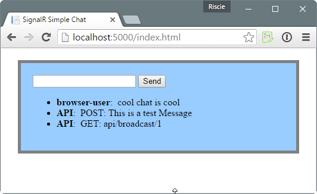

# .net core / signalR chat example
This is a simple chat example with .net core and signalR where api endpoints can create signalR broadcast messages.

## Usage
* run the application
* connect via browser to `localhost:5000/index.html`
* use the browser-page or api-endpoins to create broadcast messages

## API endpoints
* **GET**: `localhost:5000/api/broadcast/{id}`
  * eg: GET request on `localhost:5000/api/broadcast/5` triggers a broadcast to all connected browser windows. 
* **POST**: `localhost:5000/api/broadcast`
  * eg: POST request to `localhost:5000/api/broadcast` with the body: `{"body": "Hello there!"}` triggers a broadcast to all connected browser windows. 

## Used Resources
  * https://www.asp.net/signalr/overview/getting-started/tutorial-getting-started-with-signalr (core of the chat application)
  * https://www.rizamarhaban.com/2016/09/13/asp-net-core-signalr-for-windows-10-uwp-app/ (how to use signalR with .net core)

